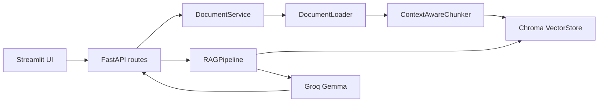

# Architecture

## Design Notes

- `app/api` owns HTTP concerns only.
- `frontend/streamlit_app.py` provides a lightweight local interface for uploads and questions.
- `app/services` coordinates workflows such as upload, persistence, loading, chunking, and indexing.
- `app/rag` owns retrieval and generation internals.
- LLM and embedding providers are isolated behind small factory/client modules.
- Chroma persists indexes under `data/indexes/chroma`, keeping uploaded files under `data/uploads`.

## Swapping Models

- Change `GROQ_MODEL` to use another Groq-supported chat model.
- Change `EMBEDDING_MODEL` to any sentence-transformer compatible model.
- Replace `VectorStore` if you want Pinecone, Weaviate, Qdrant, or FAISS.
